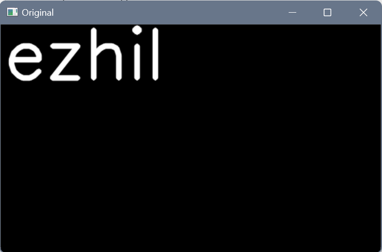
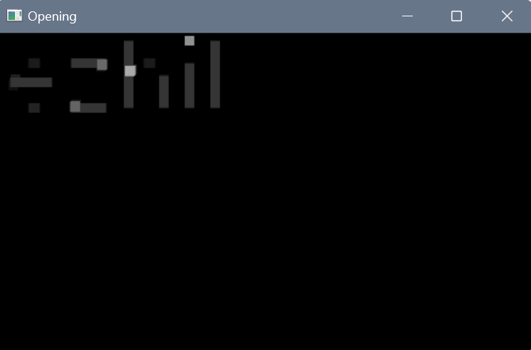
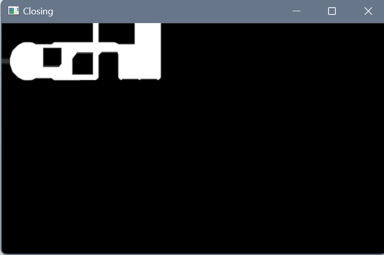

## Ex no: 11
# <p align="center">Opening and Closing

## Aim
To implement Opening and Closing using Python and OpenCV.

## Software Required
1. Anaconda - Python 3.7
2. OpenCV
## Algorithm:
### Step1:
Import the necessary packages.
<br>
### Step2:
Create the Text using cv2.putText.
<br>

### Step3:
Create the structuring element.
<br>

### Step4:
Use Opening and Closing Operations
<br>

### Step5:
End Program.
<br>

## Program:
```
DEVELOPED BY: ezhil mathi r
REG NO: 212221230026
```

``` Python
# Import the necessary packages
import cv2
import numpy as np
import matplotlib.pyplot as plt

# Create the Text using cv2.putText
img1=np.zeros((300,500),dtype='uint8')
font=cv2.FONT_ITALIC
img2=cv2.putText(img1,"ezhil",(5,70),font,3,(255,0,0),5,cv2.LINE_AA)
cv2.imshow("Original",img2)
cv2.waitKey(0)
cv2.destroyAllWindows()

# Create the structuring element
kernel1=cv2.getStructuringElement(cv2.MORPH_RECT,(21,21))
kernel2=cv2.getStructuringElement(cv2.MORPH_RECT,(9,9))

# Use Opening operation
img4=cv2.morphologyEx(img1,cv2.MORPH_OPEN,kernel2)
cv2.imshow("Opening",img4)
cv2.waitKey(0)
cv2.destroyAllWindows()

# Use Closing Operation
img3=cv2.morphologyEx(img1,cv2.MORPH_CLOSE,kernel1)
cv2.imshow("Closing",img3)
cv2.waitKey(0)
cv2.destroyAllWindows()
```
## Output:

### Display the input Image




### Display the result of Opening




### Display the result of Closing




## Result
Thus the Opening and Closing operation is used in the image using python and OpenCV.
